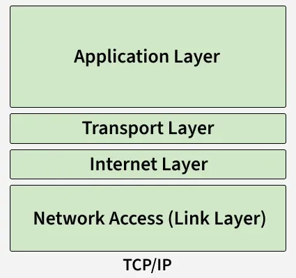
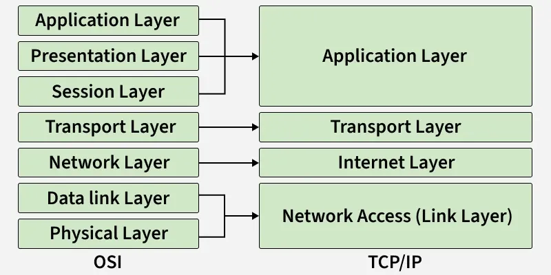

# BÀI 1 : NETWORKING - BASIC

## MỤC LỤC

1. [Tổng quan về mạng](#1 Tổng quan về mạng)
2. Các nguyên lý cơ bản của mạng máy tính

## 1. Tổng quan về mạng
Mạng máy tính là một hệ thống các thiết bị được kết nối với nhau, chẳng hạn như máy tính, máy chủ, điện thoại thông 
minh và máy in, để giao tiếp và trao đổi dữ liệu. 
Chúng giao tiếp bằng các kết nối có dây hoặc không dây và có thể trải rộng từ các mạng gia đình nhỏ đến Internet toàn 
cầu.Mạng máy tính là một hệ thống các thiết bị được kết nối với nhau, chẳng hạn như máy tính, máy chủ, điện thoại 
thông minh và máy in, để giao tiếp và trao đổi dữ liệu. Chúng giao tiếp bằng các kết nối có dây hoặc không dây và có 
thể trải rộng từ các mạng gia đình nhỏ đến Internet toàn cầu.

Tại sao chúng ta cần mạng máy tính?
Chia sẻ tài nguyên: Cho phép chia sẻ các thiết bị phần cứng như máy in, máy quét và thiết bị lưu trữ...
Chia sẻ dữ liệu: Cho phép người dùng dễ dàng chia sẻ các tệp, ứng dụng và cơ sở dữ liệu.
Giao tiếp: Hỗ trợ email, hội nghị video, nhắn tin tức thời và truy cập web.
Quản lý dữ liệu: Giúp lưu trữ, bảo mật và sao lưu dữ liệu một cách hiệu quả.
Truy cập từ xa: Cho phép người dùng truy cập vào các hệ thống và dịch vụ đám mây từ bất cứ đâu.
Tăng cường hợp tác: Cải thiện tinh thần làm việc nhóm và trao đổi thông tin giữa người dùng.

## 2. Các nguyên lý cơ bản của mạng máy tính
Mạng máy tính bắt đầu với những khái niệm cơ bản này. Nó giải thích mạng máy tính là gì, lợi ích, đặc điểm chính và các thành phần phần cứng thiết yếu liên quan.
    - Kiến thức cơ bản về mạng máy tính
    - Thiết bị mạng
    - Các loại mạng

### 2.1 Kiến thức cơ bản về mạng máy tính
#### Khái niệm
Mạng máy tính là một nhóm các thiết bị được kết nối với nhau, giao tiếp với nhau để chia sẻ dữ liệu và tài nguyên. Nó cho phép giao tiếp hiệu quả và hỗ trợ các dịch vụ như email, chia sẻ tập tin và truy cập internet.
    Kết nối nhiều thiết bị như máy tính, máy chủ và máy in.
    Cho phép chia sẻ dữ liệu và tài nguyên.
    Hỗ trợ các dịch vụ liên lạc (email, nhắn tin)
    Cho phép các ứng dụng dựa trên internet và mạng.
    Cải thiện hiệu quả và sự hợp tác

#### Thuật ngữ cơ bản
Các thuật ngữ cơ bản của mạng máy tính bao gồm:

- Mạng: Một nhóm các máy tính và thiết bị được kết nối với nhau, có khả năng giao tiếp và chia sẻ dữ liệu.
- Nút (Node): Bất kỳ thiết bị nào có thể gửi, nhận hoặc chuyển tiếp dữ liệu trong mạng. Điều này bao gồm máy tính xách tay, điện thoại di động, máy in, tai nghe, máy chủ, v.v.
- Thiết bị mạng: Các thiết bị quản lý và hỗ trợ các chức năng mạng. Bao gồm bộ định tuyến, bộ chuyển mạch, bộ chia mạng và điểm truy cập.
- Phương tiện truyền dẫn: Là môi trường vật lý hoặc không dây mà qua đó dữ liệu được truyền giữa các thiết bị.
- Phương tiện truyền dẫn có dây: Cáp Ethernet, cáp quang .
- Phương tiện không dây: Wi-Fi, Bluetooth, hồng ngoại
- Mạng lưới nhà cung cấp dịch vụ: Là các mạng lưới được cung cấp bởi các nhà cung cấp bên ngoài, cho phép người dùng hoặc tổ chức thuê quyền truy cập và các khả năng của mạng. Điều này bao gồm các nhà cung cấp dịch vụ internet, nhà mạng di động, v.v.

#### Nguyên lý hoạt động của mạng máy tính
Các thành phần cơ bản của mạng máy tính là các nút (Nodes) và các liên kết (Links).
- Nút mạng : Bất kỳ thiết bị nào trong mạng, chẳng hạn như modem, bộ định tuyến hoặc máy tính, dùng để gửi hoặc nhận dữ liệu.
- Liên kết: Là phương tiện kết nối các nút, chẳng hạn như cáp, dây dẫn hoặc tín hiệu không dây.
- Nguyên lý hoạt động: Mạng sử dụng các quy tắc gọi là giao thức để gửi và nhận dữ liệu giữa các thiết bị. Mỗi thiết bị được xác định bằng một địa chỉ IP duy nhất.
- Tường lửa: Một công cụ bảo mật (phần cứng hoặc phần mềm) giám sát lưu lượng truy cập. Dựa trên các quy tắc đã thiết lập, nó cho phép, chặn hoặc loại bỏ dữ liệu.

#### Các loại kiến ​​trúc mạng máy tính
Mạng máy tính thuộc các danh mục rộng sau:
Kiến trúc Client-Server: Kiến trúc Client-Server là một loại kiến ​​trúc mạng máy tính trong đó các nút có thể là máy chủ hoặc máy khách. Ở đây, nút máy chủ có thể quản lý hành vi của nút máy khách.
Kiến trúc ngang hàng (Peer-to-Peer): Trong kiến ​​trúc P2P (ngang hàng) , không có khái niệm về máy chủ trung tâm. Mỗi thiết bị đều có thể hoạt động như một máy khách hoặc máy chủ.

a. Kiến trúc **Client-Server**
Mô hình máy chủ-máy khách hoạt động như thế nào?
Máy khách: Máy khách là bất kỳ thiết bị hoặc phần mềm nào khởi tạo quá trình giao tiếp bằng cách yêu cầu dữ liệu hoặc dịch vụ từ máy chủ. 

Máy chủ: Máy chủ là một hệ thống mạnh mẽ lắng nghe và phản hồi các yêu cầu từ máy khách bằng cách cung cấp dữ liệu hoặc thực hiện các tác vụ. Máy chủ thường xử lý nhiều yêu cầu đồng thời từ máy khách. 

## 3. Mô hình mạng
Mạng máy tính dựa trên các khuôn mẫu nền tảng này để chuẩn hóa việc giao tiếp. Nó giải thích cấu trúc phân lớp của các mô hình OSI và TCP/IP và nêu bật cách chúng tổ chức các chức năng mạng để luồng dữ liệu hiệu quả.

### 3.1 Mô hình OSI
Mô hình OSI (Open Systems Interconnection) là một tập hợp các quy tắc giải thích cách các hệ thống máy tính khác nhau giao tiếp qua mạng. Mô hình OSI được phát triển bởi Tổ chức Tiêu chuẩn hóa Quốc tế (ISO). Mô hình OSI bao gồm 7 lớp và mỗi lớp có các chức năng và trách nhiệm cụ thể. Cách tiếp cận theo lớp này giúp các thiết bị và công nghệ khác nhau dễ dàng làm việc cùng nhau hơn.

> [!NOTE]
> Mô hình OSI cung cấp cấu trúc rõ ràng cho việc truyền dữ liệu và quản lý các vấn đề mạng. Mô hình OSI được sử dụng rộng rãi như một tài liệu tham khảo để hiểu cách thức hoạt động của các hệ thống mạng.

#### Lớp 1: Lớp vật lý
Lớp thấp nhất của mô hình tham chiếu OSI là Lớp Vật lý. Nó chịu trách nhiệm cho kết nối vật lý thực tế giữa các thiết bị. Lớp vật lý chứa thông tin dưới dạng bit.

Lớp vật lý chịu trách nhiệm truyền tải từng bit dữ liệu riêng lẻ từ nút này sang nút khác.
Khi nhận dữ liệu, lớp này sẽ nhận tín hiệu và chuyển đổi nó thành các bit 0 và 1, sau đó gửi chúng đến lớp Liên kết dữ liệu, lớp này sẽ ghép khung dữ liệu lại với nhau.
Các thiết bị lớp vật lý phổ biến bao gồm Hub , Repeater , Modem và Cáp .

Chức năng của lớp vật lý
- Đồng bộ hóa bit: Lớp vật lý cung cấp sự đồng bộ hóa các bit bằng cách cung cấp một xung nhịp. Xung nhịp này điều khiển cả bên gửi và bên nhận, do đó cung cấp sự đồng bộ hóa ở cấp độ bit.
- Kiểm soát tốc độ bit: Lớp vật lý cũng xác định tốc độ truyền, tức là số bit được gửi mỗi giây.
- Cấu trúc vật lý: Lớp vật lý quy định cách sắp xếp các thiết bị/nút khác nhau trong mạng, ví dụ như cấu trúc mạng dạng bus , dạng sao hoặc dạng lưới .
- Chế độ truyền dẫn: Lớp vật lý cũng xác định cách dữ liệu truyền giữa hai thiết bị được kết nối. Các chế độ truyền dẫn khả thi bao gồm Simplex, Half-Duplex và Full Duplex.

#### Lớp 2: Lớp liên kết dữ liệu (DLL)
Lớp liên kết dữ liệu chịu trách nhiệm truyền tải thông điệp giữa các nút. Chức năng chính của lớp này là đảm bảo quá trình truyền dữ liệu không có lỗi từ nút này sang nút khác, vượt qua lớp vật lý.

Khi một gói tin đến trong mạng, DLL có trách nhiệm truyền nó đến Máy chủ bằng địa chỉ MAC của nó .
Gói dữ liệu ở lớp Liên kết dữ liệu được gọi là Khung (Frame). Switch và Bridge là những thiết bị phổ biến ở lớp Liên kết dữ liệu.
Gói dữ liệu nhận được từ lớp Mạng được chia nhỏ hơn nữa thành các khung tùy thuộc vào kích thước khung của NIC ( Card giao diện mạng) . DLL cũng đóng gói địa chỉ MAC của người gửi và người nhận trong phần tiêu đề.
Địa chỉ MAC của thiết bị nhận được bằng cách gửi yêu cầu ARP ( Giao thức phân giải địa chỉ ) lên đường truyền, hỏi "Ai có địa chỉ IP đó?" và máy chủ đích sẽ trả lời bằng địa chỉ MAC của nó.

Chức năng của lớp liên kết dữ liệu
Định khung: Định khung là một chức năng của lớp liên kết dữ liệu. Nó cung cấp một cách để người gửi truyền một tập hợp các bit có ý nghĩa đối với người nhận. Điều này có thể được thực hiện bằng cách gắn các mẫu bit đặc biệt vào đầu và cuối khung.
Định địa chỉ vật lý: Sau khi tạo khung dữ liệu, lớp liên kết dữ liệu sẽ thêm địa chỉ vật lý (địa chỉ MAC) của người gửi và/hoặc người nhận vào phần tiêu đề của mỗi khung dữ liệu.
Kiểm soát lỗi: Lớp liên kết dữ liệu cung cấp cơ chế kiểm soát lỗi, trong đó nó phát hiện và truyền lại các khung dữ liệu bị hỏng hoặc bị mất.
Kiểm soát luồng dữ liệu: Tốc độ truyền dữ liệu phải ổn định ở cả hai phía, nếu không dữ liệu có thể bị lỗi. Do đó, kiểm soát luồng dữ liệu điều phối lượng dữ liệu có thể được gửi đi trước khi nhận được xác nhận.
Kiểm soát truy cập: Khi một kênh truyền thông duy nhất được chia sẻ bởi nhiều thiết bị, lớp con MAC của lớp liên kết dữ liệu giúp xác định thiết bị nào đang kiểm soát kênh đó tại một thời điểm nhất định.

#### Lớp 3: Lớp mạng
Lớp mạng đảm nhiệm việc truyền dữ liệu từ máy chủ này sang máy chủ khác nằm trong các mạng khác nhau. Nó cũng xử lý việc định tuyến gói tin, tức là lựa chọn đường dẫn ngắn nhất để truyền gói tin, từ số lượng các tuyến đường có sẵn.

Địa chỉ IP của người gửi và người nhận được đặt trong phần tiêu đề bởi lớp mạng. Phân đoạn trong lớp mạng được gọi là Gói tin .
Lớp mạng được triển khai bởi các thiết bị mạng như bộ định tuyến và bộ chuyển mạch .
Chức năng của lớp mạng
Định tuyến: Các giao thức ở lớp mạng xác định tuyến đường nào phù hợp từ nguồn đến đích. Chức năng này của lớp mạng được gọi là định tuyến.
Địa chỉ logic: Để xác định duy nhất từng thiết bị trong mạng, lớp mạng định nghĩa một sơ đồ địa chỉ. Địa chỉ IP của người gửi và người nhận được lớp mạng đặt trong phần tiêu đề. Địa chỉ như vậy phân biệt mỗi thiết bị một cách duy nhất và phổ quát.

#### Lớp 4: Lớp vận chuyển
Lớp vận chuyển cung cấp dịch vụ cho lớp ứng dụng và nhận dịch vụ từ lớp mạng. Dữ liệu trong lớp vận chuyển được gọi là các phân đoạn (Segments). Lớp này chịu trách nhiệm truyền tải toàn bộ thông điệp từ đầu đến cuối.

Lớp vận chuyển cũng cung cấp xác nhận về việc truyền dữ liệu thành công và truyền lại dữ liệu nếu phát hiện lỗi.
Các giao thức được sử dụng trong lớp vận chuyển là TCP , UDP , NetBIOS và PPTP . 
Ở phía người gửi, lớp vận chuyển nhận dữ liệu đã được định dạng từ các lớp trên, thực hiện phân đoạn và cũng triển khai kiểm soát luồng và lỗi để đảm bảo truyền dữ liệu chính xác.
Nó cũng thêm số cổng nguồn và đích vào phần tiêu đề và chuyển tiếp dữ liệu đã được phân đoạn đến lớp mạng.
Thông thường, số cổng đích này được cấu hình, có thể là mặc định hoặc thủ công.
Ví dụ: khi một ứng dụng web yêu cầu máy chủ web, nó thường sử dụng cổng số 80, vì đây là cổng mặc định được gán cho các ứng dụng web. Nhiều ứng dụng có cổng mặc định được gán sẵn.
Ở phía người nhận, lớp vận chuyển đọc số cổng từ phần tiêu đề và chuyển tiếp dữ liệu đã nhận được đến ứng dụng tương ứng. Nó cũng thực hiện việc sắp xếp thứ tự và lắp ráp lại dữ liệu đã được phân đoạn.

Chức năng của lớp vận chuyển
Phân đoạn và Tái lắp ráp: Lớp này nhận thông điệp từ lớp (phiên) và chia thông điệp thành các đơn vị nhỏ hơn. Mỗi phân đoạn được tạo ra đều có một tiêu đề đi kèm. Lớp vận chuyển tại trạm đích sẽ tái lắp ráp thông điệp.
Định địa chỉ điểm dịch vụ: Để chuyển tiếp thông điệp đến đúng tiến trình, phần tiêu đề của lớp vận chuyển bao gồm một loại địa chỉ được gọi là địa chỉ điểm dịch vụ hoặc địa chỉ cổng. Do đó, bằng cách chỉ định địa chỉ này, lớp vận chuyển đảm bảo rằng thông điệp được chuyển đến đúng tiến trình.

#### Lớp 5: Lớp phiên
Lớp phiên trong mô hình OSI chịu trách nhiệm thiết lập kết nối, quản lý kết nối và chấm dứt phiên giữa hai thiết bị. Nó cũng cung cấp xác thực và bảo mật. Các giao thức được sử dụng trong lớp phiên là NetBIOS và PPTP.

Chức năng của Lớp Phiên
Thiết lập, duy trì và chấm dứt phiên: Lớp này cho phép hai tiến trình thiết lập, sử dụng và chấm dứt kết nối.
Đồng bộ hóa: Lớp này cho phép một quy trình thêm các điểm kiểm tra được coi là điểm đồng bộ hóa trong dữ liệu. Các điểm đồng bộ hóa này giúp xác định lỗi để dữ liệu được đồng bộ hóa lại một cách chính xác, tránh việc các thông điệp bị cắt ngắn đột ngột và tránh mất dữ liệu.
Bộ điều khiển hội thoại: Lớp phiên cho phép hai hệ thống bắt đầu giao tiếp với nhau ở chế độ bán song công hoặc song công hoàn toàn.
Ví dụ

Hãy xem xét một kịch bản trong đó người dùng muốn gửi tin nhắn thông qua một ứng dụng nhắn tin nào đó đang chạy trên trình duyệt của họ. "Ứng dụng nhắn tin" ở đây đóng vai trò là lớp ứng dụng cung cấp cho người dùng giao diện để tạo dữ liệu. Tin nhắn này, hay còn gọi là dữ liệu, được nén, mã hóa (nếu dữ liệu nhạy cảm) và chuyển đổi thành các bit (0 và 1) để có thể truyền tải.

#### Lớp 6: Lớp Trình bày
Lớp trình bày còn được gọi là lớp dịch thuật. Dữ liệu từ lớp ứng dụng được trích xuất tại đây và được xử lý theo định dạng yêu cầu để truyền qua mạng. Các giao thức được sử dụng trong lớp trình bày là TLS/SSL (Transport Layer Security / Secure Sockets Layer). JPEG, MPEG, GIF là các tiêu chuẩn hoặc định dạng được sử dụng để mã hóa dữ liệu, đây cũng là một phần vai trò của lớp trình bày.

Chức năng của lớp trình bày
Dịch: Ví dụ, từ ASCII sang EBCDIC .
Mã hóa/Giải mã: Mã hóa dữ liệu chuyển đổi dữ liệu thành một dạng hoặc mã khác. Dữ liệu đã mã hóa được gọi là văn bản mã hóa, và dữ liệu đã giải mã được gọi là văn bản gốc. Một giá trị khóa được sử dụng để mã hóa cũng như giải mã dữ liệu.
Nén dữ liệu: Giảm số lượng bit cần truyền tải trên mạng.

#### Lớp 7: Lớp ứng dụng
Ở lớp cao nhất trong mô hình tham chiếu OSI, chúng ta tìm thấy Lớp Ứng dụng , được triển khai bởi các ứng dụng mạng. Các ứng dụng này tạo ra dữ liệu để truyền tải qua mạng.

Lớp này cũng đóng vai trò như một cửa sổ cho các dịch vụ ứng dụng truy cập mạng và hiển thị thông tin nhận được cho người dùng.
Các giao thức được sử dụng ở lớp ứng dụng bao gồm SMTP , FTP , DNS , v.v.

Chức năng của lớp ứng dụng
Các chức năng chính của lớp ứng dụng được nêu dưới đây.

Thiết bị đầu cuối ảo mạng (NVT): Cho phép người dùng đăng nhập vào máy chủ từ xa.
Quản lý và Truy cập Chuyển giao Tập tin (FTAM): Ứng dụng này cho phép người dùng truy cập các tập tin trên máy chủ từ xa, truy xuất các tập tin trên máy chủ từ xa và quản lý hoặc điều khiển các tập tin từ máy tính từ xa.
Dịch vụ bưu chính: Cung cấp dịch vụ email.
Dịch vụ thư mục: Ứng dụng này cung cấp các nguồn cơ sở dữ liệu phân tán và quyền truy cập vào thông tin toàn cầu về nhiều đối tượng và dịch vụ khác nhau.

#### Dữ liệu lưu chuyển như thế nào trong mô hình OSI ?
Khi chúng ta truyền thông tin từ thiết bị này sang thiết bị khác, thông tin đó sẽ đi qua 7 lớp của mô hình OSI. Đầu tiên, dữ liệu di chuyển xuống qua 7 lớp từ phía người gửi và sau đó quay trở lại 7 lớp ở phía người nhận. Dữ liệu di chuyển qua mô hình OSI theo từng bước:

Lớp ứng dụng: Các ứng dụng tạo ra dữ liệu.
Lớp trình bày: Dữ liệu được định dạng và mã hóa.
Lớp phiên: Các kết nối được thiết lập và quản lý.
Lớp vận chuyển: Dữ liệu được chia thành các phân đoạn để đảm bảo truyền tải đáng tin cậy.
Lớp mạng: Các phân đoạn được đóng gói thành các gói dữ liệu và được định tuyến.
Lớp liên kết dữ liệu: Các gói dữ liệu được đóng khung và gửi đến thiết bị tiếp theo.
Lớp vật lý: Các khung dữ liệu được chuyển đổi thành bit và truyền tải về mặt vật lý.

#### Tại sao mô hình OSI lại quan trọng?
Mô hình OSI rất quan trọng vì nó cung cấp cho người dùng một cấu trúc rõ ràng về "cách dữ liệu di chuyển trong mạng?". Vì mô hình OSI bao gồm 7 lớp, mỗi lớp có vai trò cụ thể của nó, và nhờ đó giúp hiểu, xác định và giải quyết các vấn đề mạng phức tạp một cách dễ dàng bằng cách tập trung vào một trong các lớp chứ không phải toàn bộ mạng.

> [!NOTE] 
> Mặc dù Internet hiện đại không còn ưa chuộng mô hình OSI, nhưng mô hình OSI vẫn rất hữu ích trong việc giải quyết các vấn đề mạng. Nó giúp mọi người dễ dàng hiểu các khái niệm mạng.

### 3.2 Mô hình TCP/IP
Mô hình TCP/IP là một khung mạng phân lớp giải thích cách dữ liệu được truyền giữa các thiết bị trên mạng bằng cách sử dụng các giao thức tiêu chuẩn để đảm bảo truyền tải đáng tin cậy và hiệu quả.

Được định nghĩa là kiến ​​trúc bốn lớp bao gồm các lớp Ứng dụng, Vận chuyển, Internet và Truy cập mạng.
Được tiêu chuẩn hóa bởi RFC 1122, trong đó quy định cấu trúc và hành vi của nó.
Đơn giản và thiết thực hơn so với mô hình OSI bảy lớp.
Nó đóng vai trò là khung sườn cốt lõi của Internet hiện đại và các hệ thống mạng.

#### 1. Lớp ứng dụng
Lớp trên cùng của mô hình TCP/IP, gần người dùng nhất, nơi các ứng dụng như trình duyệt web, trình soạn thảo email và công cụ chia sẻ tập tin tương tác với mạng. Nó cung cấp giao diện giữa phần mềm người dùng và các lớp thấp hơn xử lý việc truyền dữ liệu, cho phép giao tiếp liền mạch trên mạng.

Đóng vai trò như một cầu nối giữa các ứng dụng người dùng và các lớp mạng thấp hơn.
Hỗ trợ các giao thức như HTTP, FTP, SMTP và DNS.
Xử lý định dạng dữ liệu để thông tin được cả người gửi và người nhận hiểu chính xác.
Cung cấp mã hóa để liên lạc an toàn.
Quản lý các phiên để theo dõi các kết nối đang diễn ra.

#### 2. Lớp vận chuyển
Đảm bảo việc truyền tải dữ liệu đáng tin cậy và hiệu quả giữa các thiết bị, quản lý phân đoạn, sắp xếp và truyền lại khi cần thiết.

Phân đoạn và tái lắp ráp: Chia các thông điệp lớn thành các gói nhỏ và tái lắp ráp chúng tại đích đến.
Đảm bảo truyền tải đáng tin cậy và xử lý lỗi: TCP kiểm tra lỗi, gửi lại dữ liệu bị mất và đảm bảo thứ tự dữ liệu chính xác.
Giao tiếp nhanh: UDP cung cấp khả năng truyền tải không cần kết nối, độ trễ thấp và không cần kiểm tra lỗi.
Kiểm soát luồng dữ liệu: Ngăn chặn tình trạng quá tải ở phía người nhận bằng cách điều chỉnh luồng dữ liệu.
Ghép kênh: Sử dụng số cổng để cho phép nhiều ứng dụng cùng chia sẻ mạng đồng thời.

a. **TCP** (Transmission Control Protocol): TCP được sử dụng khi độ tin cậy và độ chính xác là yếu tố quan trọng. Nó đảm bảo dữ liệu được truyền tải chính xác như đã gửi.

Kiểm tra lỗi: TCP phát hiện lỗi trong dữ liệu bằng cách sử dụng mã kiểm tra để đảm bảo tính toàn vẹn.
Truyền lại: Nếu bất kỳ dữ liệu nào bị mất hoặc bị hỏng trong quá trình truyền, TCP sẽ tự động gửi lại.
Truyền tải theo thứ tự: Dữ liệu được chia thành các gói và giao thức TCP đảm bảo các gói này đến theo đúng trình tự.
Giao thức hướng kết nối: TCP thiết lập kết nối giữa người gửi và người nhận trước khi gửi dữ liệu, duy trì phiên kết nối ổn định trong suốt quá trình giao tiếp.
Các trường hợp sử dụng: Tải trang web, tải xuống tập tin, gửi email hoặc bất kỳ ứng dụng nào yêu cầu dữ liệu đầy đủ và chính xác.
b. **UDP** (User Datagram Protocol): UDP được sử dụng khi tốc độ quan trọng hơn độ chính xác tuyệt đối. Nó nhanh hơn nhưng không đảm bảo việc truyền tải đáng tin cậy.

Không kiểm tra lỗi: UDP không xác minh xem dữ liệu có lỗi hay không.
Không truyền lại: Dữ liệu bị mất hoặc hư hỏng sẽ không được gửi lại.
Giao hàng không theo thứ tự: Các gói hàng có thể đến không theo thứ tự và hệ thống không thể khắc phục điều này.
Nhẹ nhàng: Vì tránh được các bước kiểm tra và kết nối bổ sung, UDP nhanh hơn và sử dụng ít tài nguyên hơn.
Các trường hợp sử dụng: Phát trực tiếp video, chơi game trực tuyến, cuộc gọi VoIP hoặc các ứng dụng thời gian thực mà tốc độ quan trọng hơn độ tin cậy.

#### 3. Lớp Internet
Chịu trách nhiệm định địa chỉ, đóng gói và định tuyến các gói dữ liệu để chúng có thể di chuyển qua các mạng và đến đúng thiết bị đích. Điều này đảm bảo dữ liệu có thể di chuyển giữa các mạng khác nhau một cách hiệu quả.
Địa chỉ logic: Gán địa chỉ IP để xác định thiết bị nguồn và thiết bị đích.
Định tuyến gói tin: Xác định đường dẫn tốt nhất để dữ liệu di chuyển qua mạng.
Phân mảnh và tái lắp ráp: Chia các gói dữ liệu lớn thành các gói nhỏ hơn để truyền tải và tái lắp ráp chúng tại đích đến.
Hỗ trợ giao thức: Chủ yếu sử dụng IP (Giao thức Internet), cùng với các giao thức hỗ trợ như ICMP để báo cáo lỗi và ARP để phân giải địa chỉ.

#### 4. Truy cập mạng (Lớp liên kết)
Chịu trách nhiệm truyền dữ liệu vật lý qua phần cứng mạng, bao gồm cáp, bộ chuyển mạch và kết nối không dây. Nó xử lý định dạng dữ liệu cho môi trường mạng và đảm bảo dữ liệu đến được thiết bị tiếp theo trên đường truyền.
Truyền tải vật lý: Gửi và nhận các bit dữ liệu thô thông qua các phương tiện vật lý như cáp Ethernet, cáp quang hoặc Wi-Fi.
Định dạng khung: Tổ chức dữ liệu thành các khung để truyền tải và nhận dạng đúng cách bởi các thiết bị.
Phát hiện lỗi: Phát hiện lỗi truyền dữ liệu bằng cách sử dụng tổng kiểm tra hoặc CRC.
Địa chỉ MAC: Sử dụng địa chỉ phần cứng để xác định các thiết bị trong cùng một phân đoạn mạng.
Kiểm soát truy cập: Xác định cách nhiều thiết bị chia sẻ cùng một phương tiện vật lý, tránh xung đột.

#### Nguyên lý hoạt động của mô hình TCP/IP
Nguyên lý hoạt động của TCP/IP có thể được giải thích bằng sơ đồ dưới đây:

Khi gửi dữ liệu (Từ người gửi đến người nhận)
Lớp ứng dụng: Phần mềm của người dùng (như trình duyệt web hoặc ứng dụng email) tạo ra dữ liệu và chuyển tiếp dữ liệu đó đến lớp tiếp theo.
Lớp vận chuyển: Dữ liệu được chia thành các phân đoạn, và TCP hoặc UDP sẽ thêm thông tin điều khiển để đảm bảo việc truyền tải đáng tin cậy hoặc tốc độ truyền nhanh.
Lớp Internet: Mỗi phân đoạn được đóng gói vào các gói dữ liệu có địa chỉ IP để có thể được định tuyến qua mạng đến thiết bị đích.
Lớp truy cập mạng (lớp liên kết): Các gói dữ liệu được chuyển đổi thành các khung phù hợp với mạng vật lý (Ethernet, Wi-Fi) và được truyền qua cáp hoặc tín hiệu không dây.
Khi nhận dữ liệu (tại đích đến)
Lớp truy cập mạng: Các khung dữ liệu được nhận từ phương tiện vật lý và được kiểm tra lỗi.
Lớp Internet: Các khung dữ liệu được giải nén để trích xuất các gói tin và sử dụng địa chỉ IP để đảm bảo chúng đến đúng thiết bị.
Lớp vận chuyển: Các phân đoạn được lắp ráp lại thành thông điệp gốc, và mọi dữ liệu bị thiếu hoặc bị hỏng sẽ được sửa chữa (nếu sử dụng TCP).
Lớp ứng dụng: Toàn bộ dữ liệu được chuyển đến ứng dụng của người dùng (ví dụ như trình duyệt hiển thị trang web hoặc ứng dụng email hiển thị tin nhắn).

#### Tại sao TCP/IP được sử dụng thay vì mô hình OSI?
Giao thức TCP/IP được ưa chuộng hơn mô hình OSI vì nó đơn giản, thiết thực và được triển khai rộng rãi trong các mạng thực tế và trên Internet. Không giống như OSI, chủ yếu mang tính lý thuyết, TCP/IP được điều khiển bởi giao thức và tập trung vào các nhu cầu giao tiếp thực tế.

Cấu trúc đơn giản hơn: TCP/IP chỉ có 4 lớp, so với 7 lớp trong mô hình OSI, giúp việc triển khai và hiểu nó trong các hệ thống thực tế dễ dàng hơn.
Thiết kế dựa trên giao thức: TCP/IP được thiết kế dựa trên các giao thức đang hoạt động, trong khi OSI chủ yếu là một khung lý thuyết.
Tính linh hoạt và mạnh mẽ: TCP/IP thích ứng tốt với nhiều phần cứng và mạng khác nhau, đồng thời bao gồm khả năng xử lý lỗi, định tuyến và kiểm soát tắc nghẽn.
Tiêu chuẩn mở: TCP/IP là tiêu chuẩn mở, miễn phí sử dụng và không bị kiểm soát bởi bất kỳ tổ chức nào, điều này đã giúp nó được chấp nhận rộng rãi trên toàn thế giới.
Ứng dụng thực tế so với mô hình lý thuyết: OSI rất tốt cho việc học và nắm vững các nguyên tắc thiết kế, nhưng TCP/IP mới là mô hình được sử dụng thực tế trong mạng máy tính.

#### Hạn chế
Độ phức tạp đối với người mới bắt đầu: Có thể khó hiểu đầy đủ tất cả các quy trình.
Không có sự ràng buộc nghiêm ngặt về lớp: Không giống như mô hình OSI, ranh giới giữa các lớp không cố định, điều này có thể dẫn đến sự khác biệt trong quá trình triển khai.
Chi phí phát sinh: Các tính năng kiểm tra lỗi và độ tin cậy của TCP có thể làm tăng thêm chi phí dữ liệu.
Hạn chế về bảo mật: Giao thức TCP/IP cơ bản không được thiết kế với các tính năng bảo mật tích hợp mạnh mẽ; cần thêm các giao thức bổ sung như TLS/SSL.
Hỗ trợ đa phương tiện hạn chế: Thiết kế ban đầu tập trung vào dữ liệu, không được tối ưu hóa cho âm thanh/video thời gian thực (cần thêm các giao thức).

